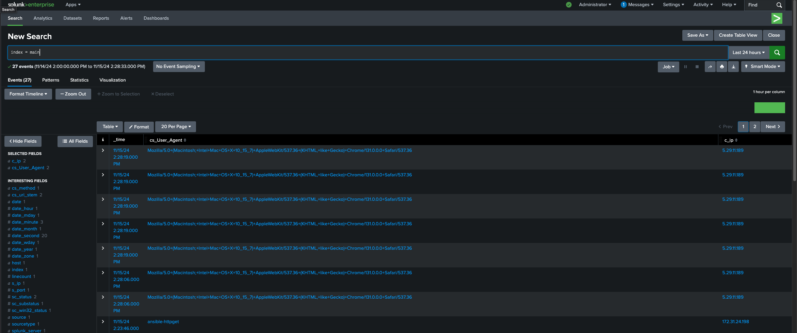

# Refael Project

## Overview
This Ansible project automates the deployment and configuration of:
1. **Active Directory** and a new domain (`rafael.local`) on a Windows Server.
2. **Microsoft Certification Authority** on the Windows Server.
3. **Splunk Standalone** on a Linux server using Docker, secured with a certificate from the Windows Certification Authority.
4. **IIS (Internet Information Services)** on the Windows Server as a web server.
5. **Log forwarding** from the IIS server to the Splunk server.

---

## Prerequisites
- Ansible installed on the control node.
- Python and required dependencies installed on the Ansible control node.
- Access to a Windows server and a Linux server with proper permissions.
- Network connectivity between the control node, Windows server, and Linux server.
- Necessary privileges to install and configure roles on target servers.

---

## Project Structure

- **`main.yaml`**: Entry point for the playbooks that includes the task execution order.
- **`ansible.cfg`**: Configuration file for Ansible.
- **`hosts.yaml`**: Inventory file specifying target hosts (Linux and Windows servers).
- **`group_vars`**: Contains variables specific to groups of hosts.
- **`host_vars`**: Contains variables specific to individual hosts.
- **`roles`**: Modular components for each task:
  - **`active_directory`**: Configures Active Directory and creates the `rafael.local` domain.
  - **`certs_setup`**: Sets up Microsoft Certification Authority.
  - **`splunk_docker`**: Deploys Splunk using Docker on the Linux server.
  - **`iis_server`**: Installs and configures IIS on the Windows server.
  - **`log_forwarding`**: Configures IIS to forward logs to the Splunk server.

---

## Steps and Processes

### 1. Active Directory Setup
- Installs and configures Active Directory on the Windows server.
- Creates a domain named `rafael.local`.
- Configurations and variables for this task are in `roles/active_directory`.

### 2. Certification Authority Setup
- Installs Microsoft Certification Authority on the Windows server.
- Generates a certificate to be used by the Splunk server.
- Includes a PowerShell template for automation (`certs.ps1.j2`).

### 3. IIS Installation
- Installs IIS on the Windows server to serve as a web server.
- Configurations are in `roles/iis_server`.

### 4. Log Forwarding to Splunk
- Configures IIS to forward access logs to the Splunk server.
- Templates (`outputs.conf.j2` and `inputs.conf.j2`) are used to set up the Splunk Universal Forwarder.

### 5. Splunk Deployment
- Deploys Splunk as a Docker container on the Linux server.
- Configures Splunk with the certificate issued by the Windows Certification Authority.
- Docker configurations and templates are in `roles/splunk_docker`.

---

## How to Run
1. Update `hosts.yaml` with your target server details.
2. Review and modify the variables in `group_vars` and `host_vars` as necessary.
3. Execute the playbook:
   ```bash
   ansible-playbook -i hosts.yaml main.yaml
   ```

---


## Splunk Screenshots Images

